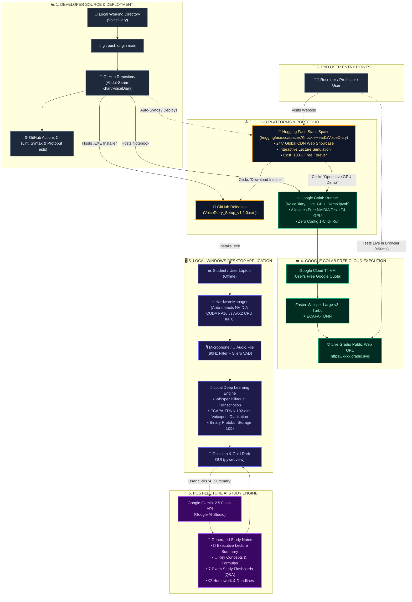

# VoiceDiary System Architecture & Ecosystem Flowchart
**VoiceDiary © 2026 Abdul Sarim Khan. All Rights Reserved.**

This document details the multi-tiered ecosystem connecting **Developer Deployment, GitHub CI/CD, Hugging Face Static Spaces, Google Colab NVIDIA T4 GPU Cloud Demo, Gemini 2.5 Flash API, and the Local Windows Desktop Engine**.

---

## 📊 Complete Ecosystem Flowchart

