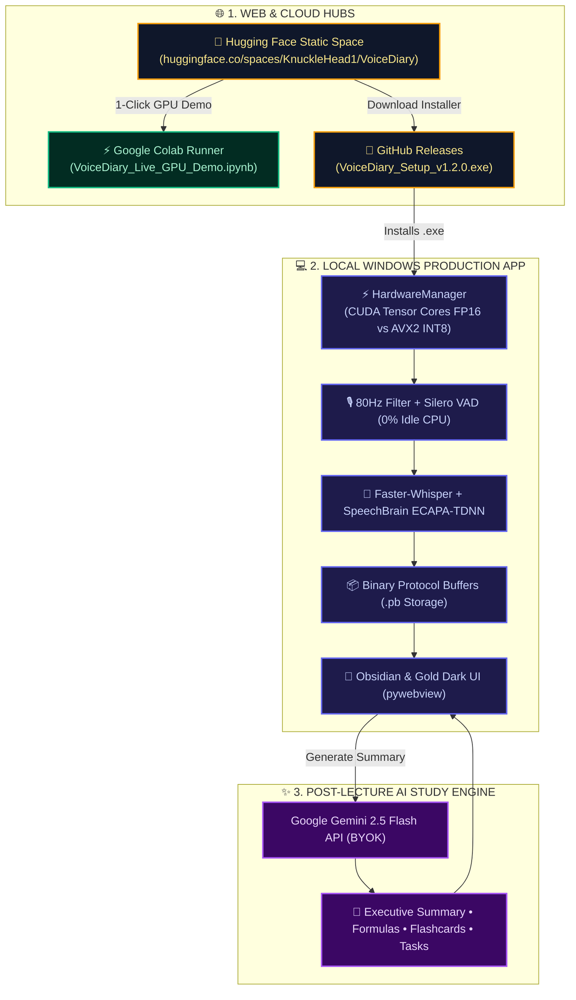

# VoiceDiary 🎙️
### Bilingual Classroom Lecture Note-Taking & Speaker Diarization AI
**VoiceDiary © 2026 [Abdul Sarim Khan](https://github.com/Abdul-Sarim-Khan). All Rights Reserved.**

<div align="center">

[](https://huggingface.co/spaces/KnuckleHead1/VoiceDiary)
[](https://colab.research.google.com/github/Abdul-Sarim-Khan/VoiceDiary/blob/main/notebooks/VoiceDiary_Live_GPU_Demo.ipynb)
[](LICENSE)
[](https://python.org)

</div>

---

## 🌐 Official Web Portal & Live Demos

Experience VoiceDiary across the web, cloud, and desktop:

| Platform | URL / Entry Point | Purpose | Compute & Cost |
|---|---|---|---|
| **🤗 Hugging Face Spaces** | [**huggingface.co/spaces/KnuckleHead1/VoiceDiary**](https://huggingface.co/spaces/KnuckleHead1/VoiceDiary) | Official 24/7 Web Showcase & Simulation Hub | **100% Free** (Global CDN) |
| **⚡ Google Colab GPU Demo** | [**Open in Google Colab (NVIDIA T4 GPU)**](https://colab.research.google.com/github/Abdul-Sarim-Khan/VoiceDiary/blob/main/notebooks/VoiceDiary_Live_GPU_Demo.ipynb) | Real-time `large-v3-turbo` + `ECAPA-TDNN` cloud execution | **Free Cloud GPU** (Google T4) |
| **💾 Desktop Application** | [**Download Windows Installer (.exe)**](https://github.com/Abdul-Sarim-Khan/VoiceDiary/releases/latest) | 100% Offline, Hardware-Adaptive Desktop Software | **Local Hardware** (NVIDIA/Intel/AMD) |

---

## 📖 Overview

**VoiceDiary** is a production-grade, hardware-adaptive AI application designed for bilingual university classroom environments (**Urdu + English code-switching**). It transcribes multi-speaker classroom lectures with near-zero latency, builds persistent 50-embedding voiceprints to differentiate the instructor from students, and generates structured lecture study notes, key mathematical formulas, exam revision flashcards, and homework action items via **Google Gemini 2.5 Flash**.

---

## 🌟 Key Features

- 🎤 **Real-Time Live Lecture Transcription** — High-accuracy bilingual speech-to-text supporting Urdu script, Roman Urdu, and English.
- 👤 **50-Voiceprint Speaker Diarization** — SpeechBrain ECAPA-TDNN vector matrix matching identifying speakers in `<0.1ms`.
- ✨ **Gemini 2.5 Flash AI Summaries** — Generates Executive Summaries, Key Formulas, and Exam Q&A Flashcards in `<1.5s`.
- ⚡ **Dynamic Hardware Auto-Adaptation** — Automatically engages NVIDIA CUDA Tensor Cores (`float16`) or Multi-Threaded AVX2 CPU vectorization (`int8`).
- 📁 **Universal Audio File Ingestion** — Process recorded audio files (`.mp3`, `.wav`, `.m4a`, `.flac`, `.ogg`) with real-time progress.
- 📝 **Multi-Format Export Engine** — Export notes to Markdown (`.md`), Plain Text (`.txt`), or Timed Subtitles (`.srt`).
- 🔒 **100% Offline & Private** — All speech recognition and diarization models run entirely on your local machine.
- 🧹 **Zero-Trace Clean Uninstaller** — Full automated wiping of all application and AppData directories upon uninstallation.

---

## 📊 End-to-End System Architecture



---

## 🛠️ Tech Stack & Model Benchmarks

| Component | Technology | Version / Format | Benchmark Latency |
|---|---|---|---|
| **Speech-to-Text** | [Faster-Whisper](https://github.com/SYSTRAN/faster-whisper) (CTranslate2) | Large-v3-Turbo / Base / Small | `< 0.3s` per 5s chunk |
| **Speaker Diarization** | [SpeechBrain ECAPA-TDNN](https://huggingface.co/speechbrain/spkrec-ecapa-voxceleb) | 192-dim Centroid Vectors | `< 0.1ms` matrix match |
| **Voice Activity Detection** | [Silero VAD v5](https://github.com/snakers4/silero-vad) | 80Hz Butterworth Filter | `< 1ms` per 30ms window |
| **AI Summarization** | [Google Gemini 2.5 Flash](https://aistudio.google.com/) | REST API (BYOK in Settings) | `< 1.5s` for 1-hour transcript |
| **Data Serialization** | [Protocol Buffers v3](https://protobuf.dev/) | Binary Stubs (`.pb`) | Instantaneous Zero-Copy |
| **GUI Framework** | [pywebview](https://pywebview.flowrl.com/) | HTML5 / CSS3 / JavaScript | 60 FPS Native Window |

---

## 📦 Local Installation & Setup

### 1. Run from Source (Development)
```bash
# Clone the repository
git clone https://github.com/Abdul-Sarim-Khan/VoiceDiary.git
cd VoiceDiary

# Install dependencies
pip install -r requirements.txt

# Launch VoiceDiary
python run.py
```

### 2. Build Standalone Installer (.exe)
```bash
# Compiles binary executable and generates Inno Setup installer wizard
python build.py --installer
```

---

## 📄 License & Author

**Author & Creator:** **Abdul Sarim Khan**  
**License:** [MIT License](LICENSE) — Copyright © 2026 Abdul Sarim Khan. All Rights Reserved.
